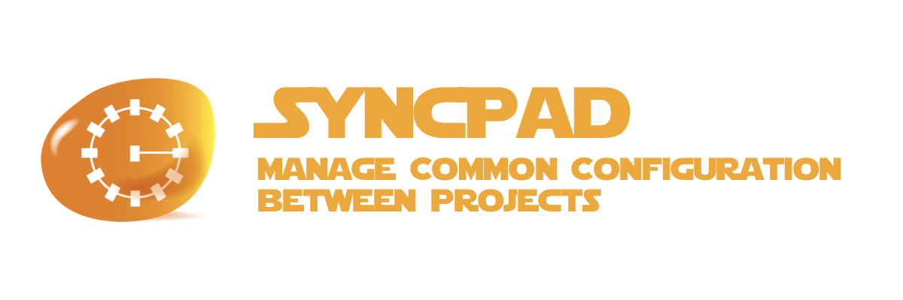

# syncpad



> **THIS PROJECT IS STILL IN THE DESIGN PHASE**
>
> IDEAS & CONTRIBUTIONS ARE WELCOME
>
> An [Open Source Universe](https://github.com/intellibus/approach) Project

---

## Contents

- [syncpad](#syncpad)
  - [Contents](#contents)
  - [Features ✨](#features-)
  - [Install 🛠](#install-)
  - [Usage 🔭](#usage-)
  - [Documentation 🛰](#documentation-)
  - [Contributing 🌎](#contributing-)
  - [License ⚖️](#license-️)

## Features ✨

- Get Saved Tabs `Planned`
- Update Saved Tabs `Planned`
- Create New Saved Tabs `Planned`
- Modify Projects (Tab Groups) `Planned`
- Typescript Support `Planned`

## Install 🛠

```sh
npm install syncpad
```

## Usage 🔭

Read more about the [Design](https://github.com/intellibus/syncpad/blob/main/DESIGN.md) behind `syncpad` here.

```sh
$ syncpad create
Creating a Syncpad Grid in your BigParser Account...
Congrats! Your Syncpad Grid is ready for use!

$ syncpad load
Loading your Config into BigParser...
Congrats! Your Config is Ready to Sync!

$ syncpad sync
Syncing Config from BigParser into this project...
Sync Complete! Your Project Config is now up-to-date
```

## Documentation 🛰

`syncpad` *is under active development, documentation will be added once an initial release is ready.*

## Contributing 🌎

We would love for you to contribute your ideas, code, & fixes to `syncpad`.

We encourage everyone to read our [Design Document](https://github.com/intellibus/syncpad/blob/main/DESIGN.md) to learn more about the thought process behind syncpad.

Also check out the [rewards](https://github.com/intellibus/approach/blob/main/REWARDS.md) offered for contributing to the [Open Source Universe](https://github.com/intellibus/approach).

## License ⚖️

MIT
